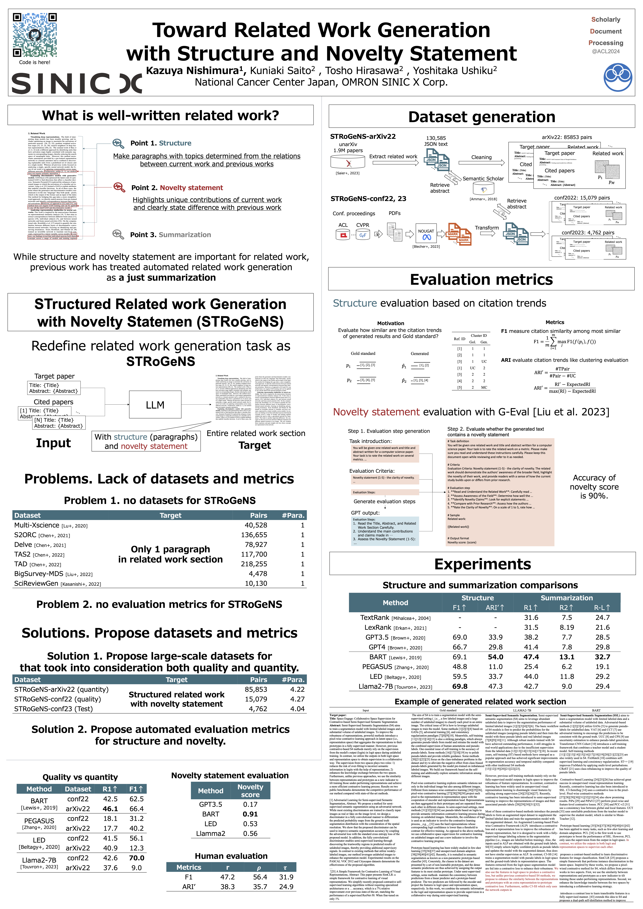

# Toward Structured Related Work Generation with Novelty Statements

[OMRON SINIC X](https://www.omron.com/sinicx/)

[Kazuya Nishimura](https://naivete5656.github.io/), [Kuniaki Saito](https://ksaito-ut.github.io/), [Tosho Hirasawa](https://cl.sd.tmu.ac.jp/~tosho/), [Yoshitaka Ushiku](https://yoshitakaushiku.net/index.html)

[Paper][[Poster]](data/figures/Relatedwork_generation.png)

## To do 

- [x] Code to process STRoGeNS arXiv
- [ ] Code to process conference proceedings
- [x] Code for comparisons
- [x] Code for metrics evaluation

<!-- *********************************** -->


　


### Description about dataset
<details>
<summary>About dataset</summary>

|Dataset|Pairs|Words|Words (Output)|Input Doc (Num)|#Para.|
|-------|-----:|-------------:|--------------:|---------------:|------:|
|Multi-XScience|40,528|778.1|116.4|4.4|1|
|S2ORC|136,655|1067.4|148.7|5.0|1|
|Delve|78,927|622.6|228.6|3.7|1|
|TAS2|117,700|1036.0|134.8|4.8|1|
|TAD|218,255|1071.4|162.3|5.2|1|
|BigSurvey-MDS|4,478|11,893.1|1,051.7|76.3|1|
|SciReviewGen|10,130|11,734.4|7,193.8|68.1|1|
|**STRoGeNS-arXiv22**|85,853|3,046.2|514.3|16.6|4.22|
|**STRoGeNS-conf22**|15,079|3,669.1|508.5|20.4|4.27|
|**STRoGeNS-conf23**|4,762|4,836.6|504.6|25.7|4.04|


</details>

<details>
<summary>Data format</summary>

```
[
  "title": "{title}",
  "abstract": "{abst}",
  "related_work": "{related work}",
  "cited": {
    "[1]": {
      "title": "{ref_1:title}",
      "abstract": "{ref_1:abst}",
    },
    ...,
    "[N]": {
      "title": "{ref_N:title}",
      "abstract": "{ref_N:abst}",
   }
]
```

### Example of data 
```
data/example.md
```
</details>


<!-- *********************************** -->

## Environment
<details>
<summary> Requirements </summary>

- [python >= 3.9](https://www.python.org/)
- [Ubuntu >= 20.04 LTS](https://ubuntu.com/)
- NVIDIA Driver >= 535
- [Docker](https://docs.docker.com/engine/install/ubuntu/) with [nvidia-container-toolkit](https://docs.nvidia.com/datacenter/cloud-native/container-toolkit/latest/install-guide.html)
- **LLAMA2 permittion**
  
  Please refer https://huggingface.co/meta-llama/Llama-2-7b
    
- **API KEY for semantic scholar**

  See https://www.semanticscholar.org/product/api#api-key for the details.

  *Please replace {S2APIKEY} to token in line 14 of [unarxiv_add_ref_info.py](preprocessing/arxiv_processing/unarxiv_add_ref_info.py) and line 14 of [conf_add_ref_info.py](preprocessing/conf_processing/conf_add_ref_info.py).

- **API KEY for GPT**
  See https://openai.com/index/openai-api/ for the details.
  
  *Please replace {GPT_API_KEY} to token in line 12 of [accuracy_eval.py](metrics/novelty_eval/accuracy_eval.py), line 12 of [novelty_eval.py](metrics/novelty_eval.py), and line 18 of [gpt_estimation.py](comparisons/GPT_estimation/gpt_estimation.py).

</details>

### Run on docker
``` /bin/bash
git clone https://github.com/omron-sinicx/STRoGeNS.git
cd STRoGeNS

bash ./docker/build.sh
bash ./docker/run.sh
bash ./docker/exec.sh

huggingface-cli login
```
*Our environment does not follow nougat environment. To use nougat, please follow [nougat docs](https://github.com/facebookresearch/nougat).


<!-- *********************************** -->


## Data Preparation
Unfortunately, due to licensing issues, we are unable to release all of the datasets we have created.
We release a part of STRoGeNS-arXiv22 consisting of articles with an open license. 
To generate the entire dataset, we release the processing code that handles the process of creating the datasets.


<details>
<summary style="font-size: 20px;"> STRoGENS-arXiv22 </summary>

### Step 1. Download arXiv dataset from unarXiv22

See the download instruction of https://github.com/IllDepence/unarXive

Decompress the xz file by following command.
``` /bin/bash
tar -xvf unarXive_230324_open_subset.tar.xz
```
Put expand files on ```./data/STRoGeNS-arXiv22/rawdata```

<details>
<summary>Folder Structure</summary>

```
data/STRoGeNS-arXiv22
├── rawdata
|   ├── 00
|   |    |- arXiv_src_0005_001.jsonl
|   |    ...
|   |- 01
|   ...
│ - re
└──rw
└
```
</details>

### Execute all preprocessing
``` /bin/bash
scripts/preproc/arxiv2022_processing.sh
```

<details>
<summary>Individual pre-processing codes</summary>

Execute each processing.
### Step 2. Extract title and etc. from jsonl.
``` /bin/bash
python ./preprocessing/arxiv_dataset/unarxiv_title_ext.py \
    --data_dir data/STRoGeNS-arXiv22/rawdata \
    --output_path data/STRoGeNS-arXiv22/rw --log_dir {logs_directory}\
    --n_dir 0 # to start intermediate directory. start from n-th file
```

### Step 3. Search abstract of cited references with Semantic scholar

Please set S2_API_KEY = "{S2APIKEY}" in line 14 of unarxiv_add_ref_info.py.
See https://www.semanticscholar.org/product/api#api-key for the details.
``` /bin/bash
python ./preprocessing/arxiv_dataset/unarxiv_add_ref_info.py \
    --data_dir data/STRoGeNS-arXiv22/rw \
    --output_path data/STRoGeNS-arXiv22/rw_wabst --log_dir {logs_directory}\
    --n_dir 0 # to start intermediate directory. start from n-th file
```

### Step 4. Convert result to huggingface format
``` /bin/bash
python ./preprocessing/arxiv_processing/unarxiv_convert2hg_format.py \
        --data_dir data/STRoGeNS-arXiv22/rw_wabst \
        --output_dir data/STRoGeNS-arXiv22/hg_format 
```
</details>

</details>


<details>
<summary style="font-size: 20px;"> STRoGeNS-conf22, 23 </summary>

We put example of dataset on data derectory ([STRoGeNS-conf22](data/STRoGeNS-conf22) and [STRoGeNS-conf23](data/STRoGeNS-conf23)).
### Step. 1 Download pdf from conference proceedings

Proceedings Python Library Requirements
  - Selenium, BeautifulSoup, slugify, jsonlines, tqdm

Script
``` /bin/bash
scripts/preproc/conf_download_pdfs.sh
```

### Step 2. Convert to markdown by NOUGAT

To make nougat environment, please refer [document of nougat](https://github.com/facebookresearch/nougat)
RUN NOUGAT
``` /bin/bash
scripts/preproc/conf_nougat.sh
```

See details [NOUGAT](https://github.com/facebookresearch/nougat)


### Execute all preprocessing
``` /bin/bash
scripts/preproc/conf_processing.sh
```

<details>
<summary>Individual pre-processing codes</summary>

### Step 3. Extract title from parsed md

``` /bin/bash
python ./preprocessing/conf_dataset/conf_title_ext.py --input_dir Conf{2023 or 2022} --output_path {title_extracted_data_dir}
```

## Step 4. Search abstract of cited references with Semantic scholar
Please set S2_API_KEY = "{S2APIKEY}" in line 14 of conf_add_ref_info.py.
``` /bin/bash
python ./preprocessing/conf_dataset/conf_add_ref_info.py --input_dir {title_extracted_data_dir}--output_path {final_data_dir}
```
</details>
</details>

<!--  ********************  -->

## Run comparisons

Model Weights

## Scripts 
``` /bin/bash
bash ./scripts/comparisons/{method_name}.sh
```

## Run evaluation for metrics
``` /bin/bash
# run humanevaluation result confirmination
python ./metrics/human_eval/calcurate_corr.py \
  --annot_dir data/annotations/humanevaluation\
  --llama2_autoeval outputs/llama2_eval.csv

# run noverty evaluation
python ./metrics/novelty_eval/accuracy_eval.py
```


## Folder structure 

``` /bin/bash
{STRoGENS ROOT} 
|- comparisons: implementation for comparisons
| |- casual_generation : LLAMA2
| |- conditional_generation: BART, PEGASUS
|   ...
|- metrics: code for evaluation metrics
|- preprocessing: code to make our dataset
└ scripts: running code
```
</details>

## License
The codes are licensed under the [###](./LICENSE). 

## Acknowledgements

Code for comparisons is based on [BART, PEGASUS, LLAMA(Peft)](https://github.com/huggingface/peft), [LexRank](https://github.com/crabcamp/lexrank), [RextRank](https://summanlp.github.io/textrank/), [LED](https://github.com/patrickvonplaten/notebooks/blob/master/Fine_tune_Longformer_Encoder_Decoder_(LED)_for_Summarization_on_pubmed.ipynb).

If you found our work useful in your research, please consider citing our works(s) at:
```
@inproceedings{kazuya2024toward,
    title = "Toward Structured Related Work Generation with Novelty Statements",
    author = "Kazuya, Nishimura  and Kuniaki, Saito  and Tosho, Hirasawa  and Yoshitaka, Ushiku",
    booktitle = "Proceedings of the Fourth Workshop on Scholarly Document Processing",
}
```
